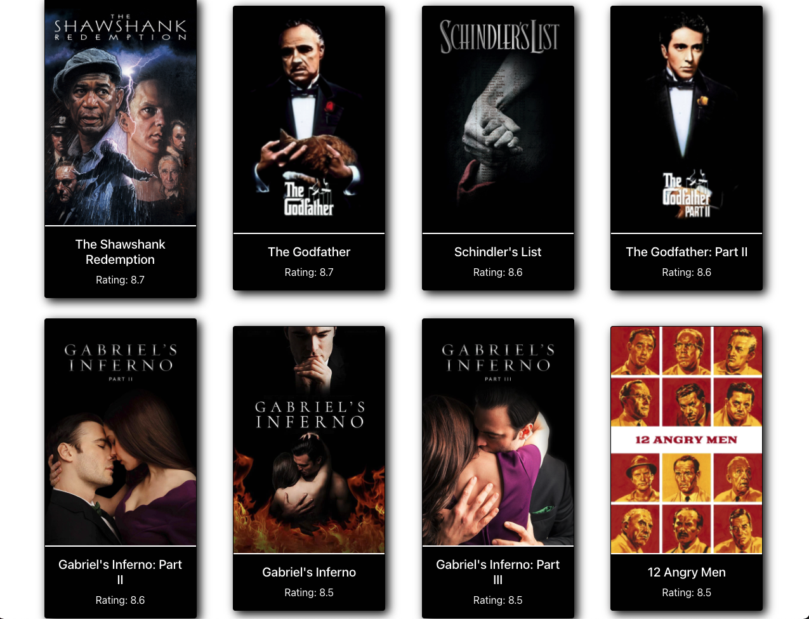
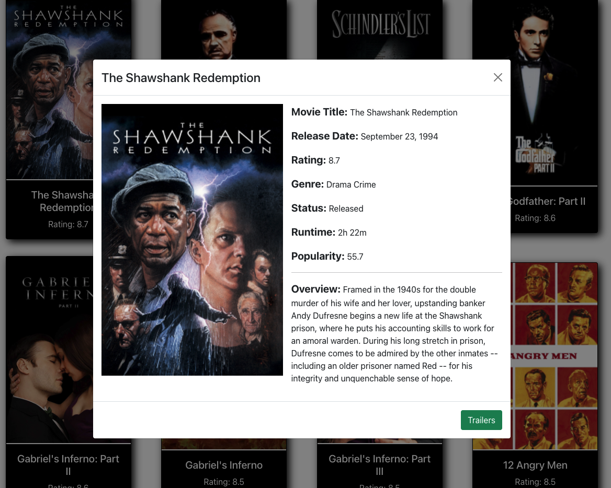
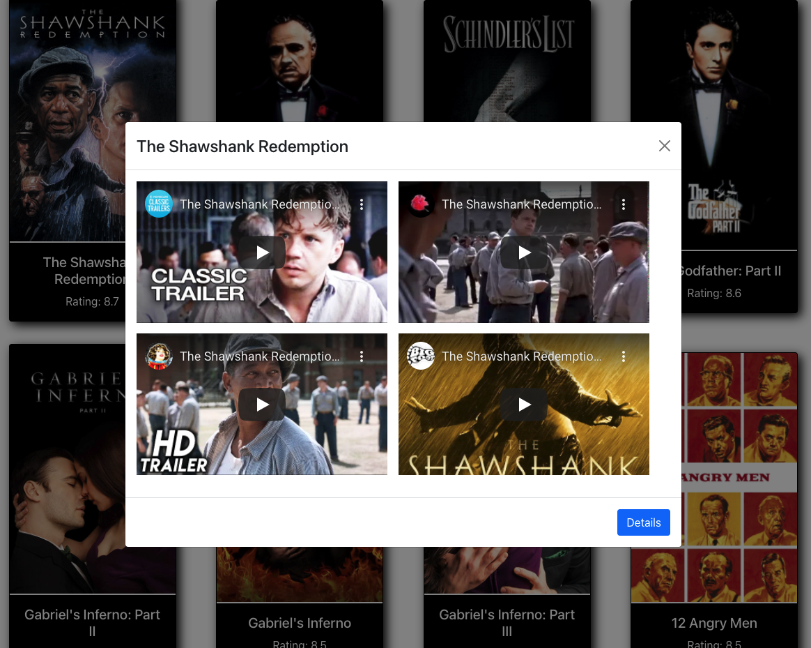

# The Movie Source 
Front-end React + Redux app that uses movie and YouTube APIs to render content and trailers 

(Live Application)[https://627d3b6370cc2a10c6a3551e--the-movie-source.netlify.app/search/the-matrix]

## Overview 
This app utilizes four endpoints of the TMDB (the movie database) api - Top Rated, Popular, Now Playing, and Upcoming movies. Each endpoint has its own page that displays the movies in a grid. 

The user can click on the movie card to view details about the movie. Furthermore, inside the modal there's a button to watch trailers. The movie trailers are delivered by Google's YouTube API without ads. 

The user also has the ability to search for any movie using the search input in the navigation bar. The search results are displayed in a grid with the ability to click for more details or watch trailers like a feature page.

## Tech Stack 
- React
- Redux
- JavaScript
- API + AJAX
- CSS
- Bootstrap

## Creator
James Riddle - (Portfolio)[https://jamescr757.github.io/Portfolio/] | (Github)[https://github.com/jamescr757]

There's a demo of this application in the Projects section of my portfolio